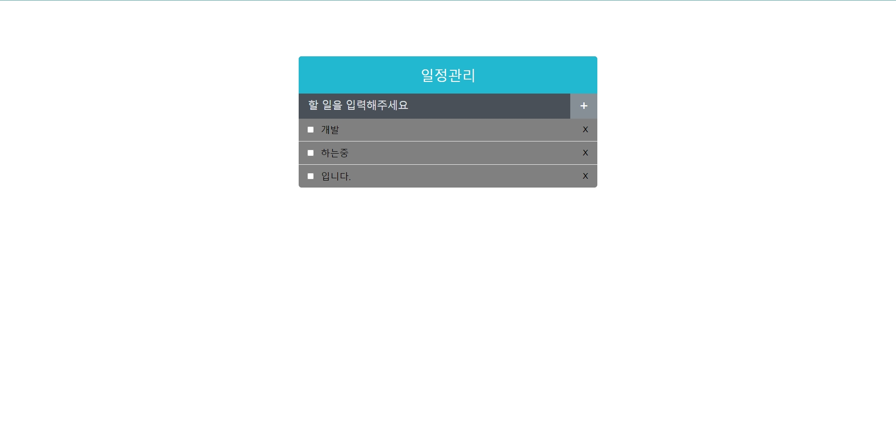
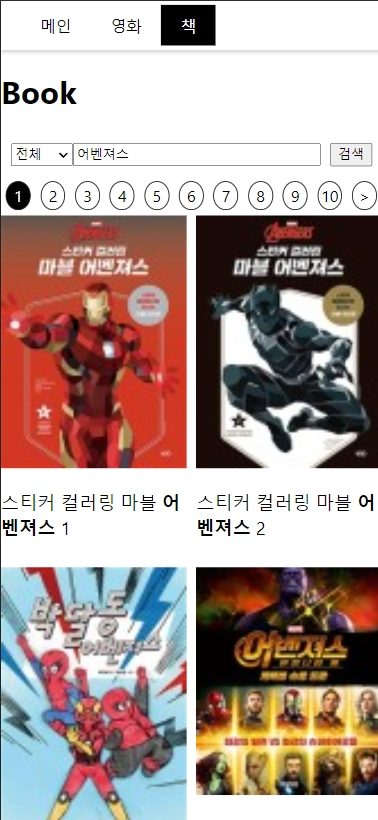
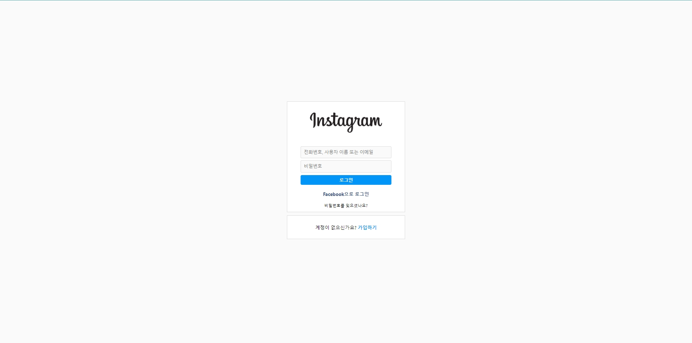
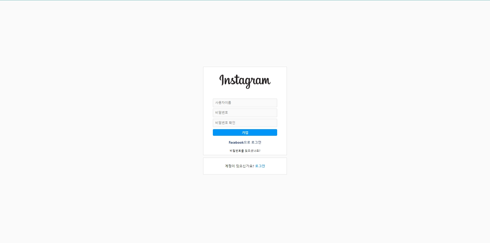
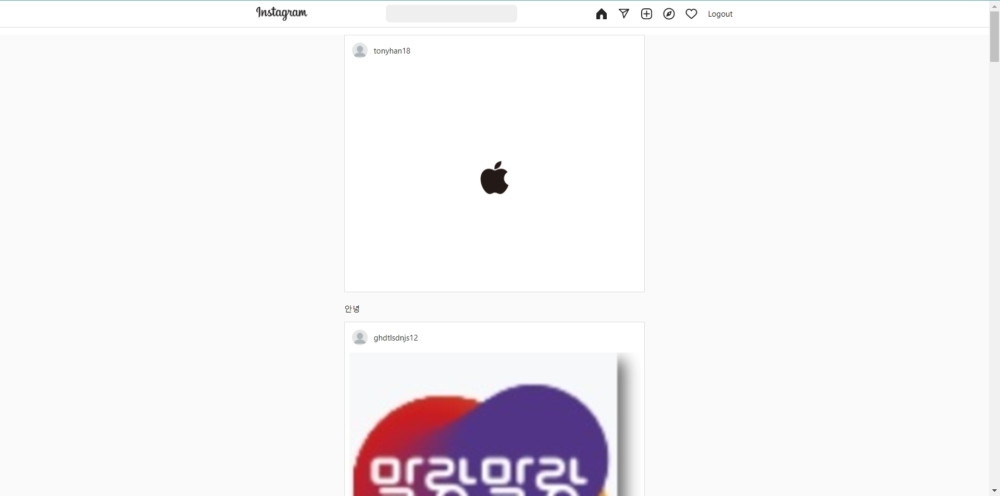
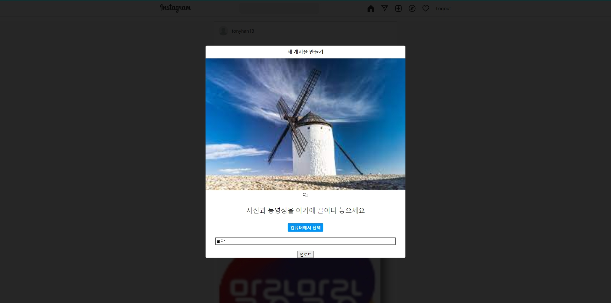

# REACT_BASE_STUDY

## TODO list

[](https://blissful-lichterman-356c5d.netlify.app/)

| 프로젝트 이름 | 사용기술                            | 코드주소                                                                    | 배포주소                                                |
| ------------- | ----------------------------------- | --------------------------------------------------------------------------- | ------------------------------------------------------- |
| todo-app      | - React<br> - Styled-Components<br> | [Todo](https://github.com/tonyhan18/React_Study_Base/tree/master/react-app) | [link](https://blissful-lichterman-356c5d.netlify.app/) |

## naver app

|  |  |  |  |
| ------------------------------------- | ------------------------------------- | ------------------------------------- | ------------------------------------- |

| 프로젝트 이름 | 사용기술                                                      | 코드주소                                                                  | 서버주소                                                                   |
| ------------- | ------------------------------------------------------------- | ------------------------------------------------------------------------- | -------------------------------------------------------------------------- |
| 네이버        | - React<br> - Styled-Components<br> - Express<br> - Axios<br> | [Client](https://github.com/tonyhan18/React_Study_Base/tree/master/naver) | [Server](https://github.com/tonyhan18/React_Study_Base/tree/master/server) |

## insta app

|  |  |
| ------------------------------------- | ------------------------------------- |
|  |  |

| 프로젝트 이름 | 사용기술                                                      | 코드주소                                                                  | 서버주소                                                                   |
| ------------- | ------------------------------------------------------------- | ------------------------------------------------------------------------- | -------------------------------------------------------------------------- |
| 인스타        | - React<br> - Styled-Components<br> - Express<br> - Axios<br> | [Client](https://github.com/tonyhan18/React_Study_Base/tree/master/insta) | [Server](https://github.com/tonyhan18/React_Study_Base/tree/master/server) |

# How to RUN

```
npm install
npm start
```

# How to DEPLOY

[https://velog.io/@ksh4820/react-express-%EB%B0%B0%ED%8F%ACNetlify-heroku](https://velog.io/@ksh4820/react-express-%EB%B0%B0%ED%8F%ACNetlify-heroku)
